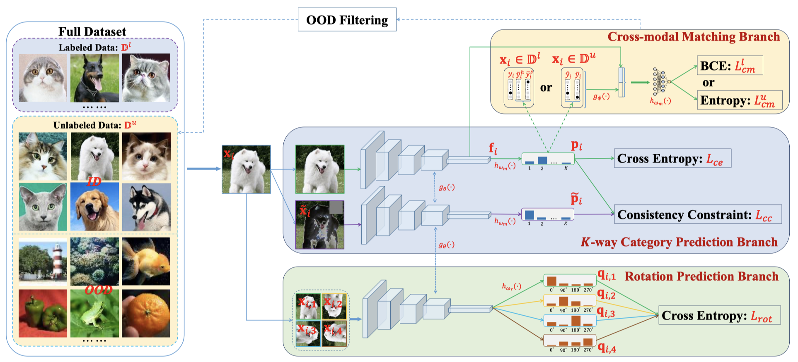

# T2T
Code for the paper: "[Trash to Treasure: Harvesting OOD Data with Cross-Modal Matching for Open-Set Semi-Supervised Learning](https://arxiv.org/abs/2108.05617)" by Junkai Huang, Chaowei Fang, Weikai Chen, Zhenhua Chai, Xiaolin Wei, Pengxu Wei, Liang Lin, and Guanbin Li.



## Usage
### Train
Train the model by 1000 labeled data of CIFAR-10 dataset and use TinyImageNet as OOD data source:
```bash
# stage 1
python train_t2t_stage1.py \
--dataset cifar10 \
--ood-dataset TIN \
--num-labeled 1000 \
--arch wideresnet \
--batch-size 64 \
--expand-labels \
--seed 5 \
--total-steps 50000 \
--eval-step 500 \
--out results/cifar10_TIN@1000.5/stage1

# stage 2
python train_t2t_stage2.py \
--dataset cifar10 \
--ood-dataset TIN \
--num-labeled 1000 \
--arch wideresnet \
--batch-size 64 \
--mu 5 \
--expand-labels \
--seed 5 \
--total-steps 200000 \
--eval-step 1000 \
--resume results/cifar10_TIN@1000.5/stage1/checkpoint.pth.tar \
--out results/cifar10_TIN@1000.5/stage2
```

Use [UDA](https://proceedings.neurips.cc/paper/2020/file/44feb0096faa8326192570788b38c1d1-Paper.pdf) as baseline:
```bash
python train_uda.py \
--dataset cifar10 \
--ood-dataset TIN \
--num-labeled 1000 \
--arch wideresnet \
--batch-size 64 \
--mu 5 \
--expand-labels \
--seed 5 \
--total-steps 250000 \
--eval-step 1000 \
--out results/cifar10_TIN@1000.5/uda
```
